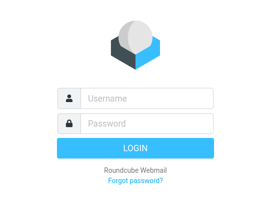
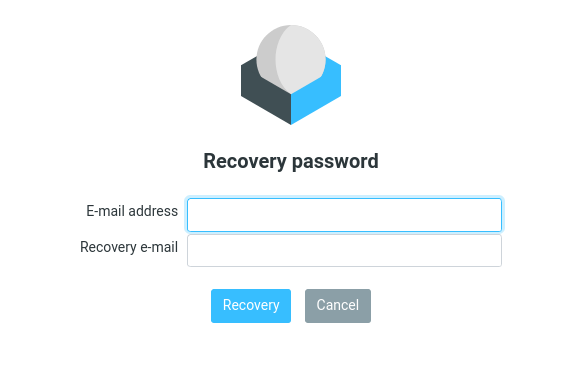
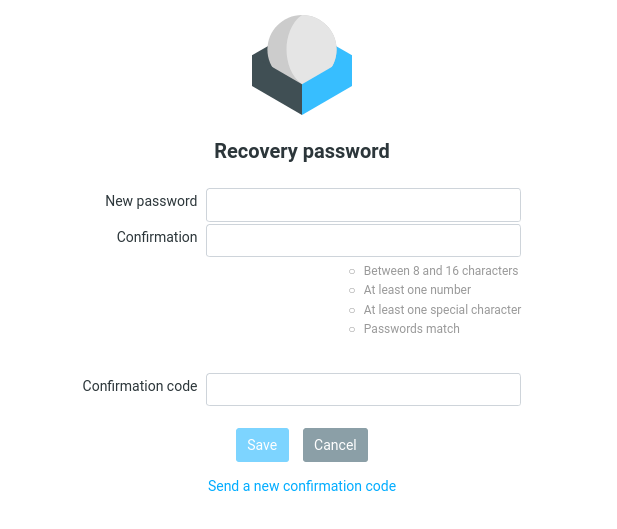
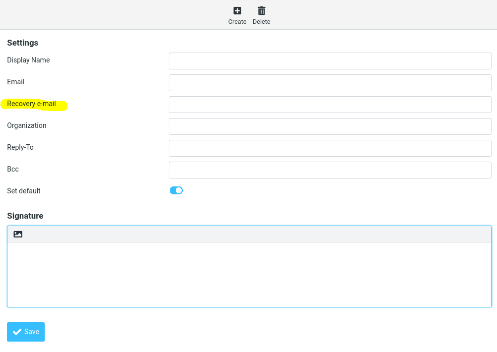

# Password Recovery — Roundcube

*[Versión en español (README.es.md)](README.es.md)*

A Roundcube plugin that lets a user regain access to their mailbox after
forgetting their password, with no administrator involved.

This is an adaptation of the original plugin
([AlfnRU/roundcube-password_recovery](https://github.com/AlfnRU/roundcube-password_recovery))
for this specific installation: **vpopmail** backend (via `vpopmaild`)
instead of a Postfix/MySQL database, with two-factor verification, real rate
limiting, and a password policy with live visual feedback.

## How it works

1. On the login screen, the user clicks **"Forgot password?"**.
2. They're asked for **both** their institutional account
   (`user@your.domain.com`) **and** the recovery email address they set
   earlier under Settings → Identities.
3. If both match what's on file, a 6-digit code is sent to that recovery
   address (valid for 30 minutes).
4. The user enters the code along with a new password. The password field
   shows live feedback on whether it meets the required policy, and the
   "Save" button stays disabled until every condition is met.
5. On save, the plugin changes the account's real password by authenticating
   against `vpopmaild` with a domain-admin account (see below) — the user
   never needs their previous password.

**By design, the response the user sees is always the same** regardless of
whether the account doesn't exist, the recovery email doesn't match, or the
rate limit was exceeded. This is intentional: it prevents the form from
being used to brute-force which accounts exist or which personal email is
linked to an institutional account.

### Rate limiting

Every recovery attempt is logged in the `password_recovery_attempts` table
(account + IP + timestamp), **independent of browser cookies/session** — a
script that doesn't keep a session cookie can't bypass this limit. Defaults:

- max **5 attempts per account** per 24h,
- max **20 attempts per source IP** per 24h (protects against one source
  probing many different accounts).

### Password policy

The new password must be 8–16 characters long (configurable, see the
`password` plugin's `password_minimum_length`/`password_maximum_length`),
include at least one digit and at least one special character. It's
validated both in the browser (live visual feedback) and on the server (in
case someone bypasses JavaScript).

## Tested with

- Roundcube 1.6.17, PHP 8.4.24
- PostgreSQL 15.18 (this installation's actual database)
- MariaDB 11.8.6 (the MySQL-flavored code paths — `ON DUPLICATE KEY UPDATE`,
  `DATE_ADD`/`INTERVAL` arithmetic, and the rate-limit cleanup query — were
  verified directly against a real MariaDB instance, not just reasoned
  through)

## Installation

These steps assume a working Roundcube install with:
- its own database in **PostgreSQL or MySQL/MariaDB** (the same one
  Roundcube already uses — no separate database needed). The plugin
  auto-detects which one via `rcube_db::db_provider`, so no extra config is
  needed either way.
- mail authentication via **vpopmail**, with the `password` plugin
  configured with `password_driver = 'vpopmaild'`.

### 1. Copy the plugin and enable it

```bash
# already in place on this installation:
#   /usr/share/roundcube/plugins/password_vpop_recovery
```

Add `'password_vpop_recovery'` to `$config['plugins']` in
`/etc/roundcube/config.inc.php`.

**Debian/Ubuntu packaged Roundcube (Debian 12+ `roundcube-core`) needs one
extra step**: the actual plugin loader reads from `/var/lib/roundcube/plugins/`,
not directly from `/usr/share/roundcube/plugins/` — every plugin shipped by
the distro is a symlink there. Without this symlink the plugin fails to load
with `Failed to load plugin file ...` and, if that error happens on every
page, the whole webmail breaks, not just recovery:

```bash
ln -s /usr/share/roundcube/plugins/password_vpop_recovery /var/lib/roundcube/plugins/password_vpop_recovery
```

(On installs where `plugins/` isn't a symlink farm — e.g. Roundcube
installed from source rather than via `.deb` — this step doesn't apply.)

### 2. Create the tables in Roundcube's own database

The plugin **does not use a separate database**: it stores its data in the
same database Roundcube already uses (no extra credentials to manage, and
it never touches the vpopmail database at all). Use whichever block matches
your Roundcube's `db_dsnw`.

**PostgreSQL:**

```sql
CREATE TABLE IF NOT EXISTS password_recovery_data (
    username        VARCHAR(128) PRIMARY KEY,
    alt_email       VARCHAR(128) NOT NULL DEFAULT '',
    token           VARCHAR(255) NOT NULL DEFAULT '',
    token_validity  TIMESTAMP NOT NULL DEFAULT '2000-01-01 00:00:00'
);

CREATE TABLE IF NOT EXISTS password_recovery_attempts (
    id          SERIAL PRIMARY KEY,
    username    VARCHAR(128) NOT NULL,
    ip          VARCHAR(64) NOT NULL,
    created_at  TIMESTAMP NOT NULL DEFAULT NOW()
);
CREATE INDEX IF NOT EXISTS idx_pra_username_time ON password_recovery_attempts (username, created_at);
CREATE INDEX IF NOT EXISTS idx_pra_ip_time ON password_recovery_attempts (ip, created_at);
```

**MySQL / MariaDB:**

```sql
CREATE TABLE IF NOT EXISTS password_recovery_data (
    username        VARCHAR(128) PRIMARY KEY,
    alt_email       VARCHAR(128) NOT NULL DEFAULT '',
    token           VARCHAR(255) NOT NULL DEFAULT '',
    token_validity  DATETIME NOT NULL DEFAULT '2000-01-01 00:00:00'
) ENGINE=InnoDB;

CREATE TABLE IF NOT EXISTS password_recovery_attempts (
    id          INT AUTO_INCREMENT PRIMARY KEY,
    username    VARCHAR(128) NOT NULL,
    ip          VARCHAR(64) NOT NULL,
    created_at  DATETIME NOT NULL DEFAULT CURRENT_TIMESTAMP,
    INDEX idx_pra_username_time (username, created_at),
    INDEX idx_pra_ip_time (ip, created_at)
) ENGINE=InnoDB;
```

(`DATETIME` rather than `TIMESTAMP` on purpose — MySQL's `TIMESTAMP` columns
silently auto-update on every row change unless explicitly told not to,
which is not what we want for `token_validity`/`created_at`.)

### 3. vpopmail admin account (needed to actually reset passwords)

`vpopmaild` requires authenticating before it will modify an account — and a
self-`slogin` isn't enough, because during recovery the user by definition
doesn't have their old password. The fix is to authenticate with an account
that has **domain-admin privileges** in vpopmail (e.g.
`postmaster@your.domain.com`), which *can* run `mod_user` against *any*
account in the domain.

If that account doesn't exist yet, it needs to be created/enabled on the
mail server first.

### 4. Sending (SMTP) account

The confirmation code is sent **before login**, at a point where Roundcube
has no active IMAP session yet — so `smtp_user`/`smtp_pass = '%u'/'%p'` from
the main config can't be reused. A dedicated, **send-only** mailbox account
is needed, authenticated against the same institutional SMTP (don't use the
unauthenticated local relay: without proper SPF/DKIM the mail ends up in
spam or gets bounced).

### 5. Configure the plugin's `config.inc.php`

On Debian/Ubuntu packaged Roundcube, every plugin's `config.inc.php` under
`/usr/share/roundcube/plugins/<name>/` is actually a symlink to a real file
under `/etc/roundcube/plugins/<name>/` — check any core plugin (e.g.
`password`) and you'll see the same pattern. This keeps host-specific
config in `/etc` (survives package upgrades) instead of under `/usr/share`
(package-managed). Follow the same convention here:

```bash
mkdir -p /etc/roundcube/plugins/password_vpop_recovery
cp /usr/share/roundcube/plugins/password_vpop_recovery/config.inc.php.dist \
   /etc/roundcube/plugins/password_vpop_recovery/config.inc.php
ln -s /etc/roundcube/plugins/password_vpop_recovery/config.inc.php \
      /usr/share/roundcube/plugins/password_vpop_recovery/config.inc.php
```

(If you're not on a Debian-packaged Roundcube, it's fine to just keep
`config.inc.php` directly inside the plugin's own directory instead — skip
the symlink and edit it in place.)

Fill in at least:

| Variable | What it is |
|---|---|
| `pr_users_table` | `'password_recovery_data'` |
| `pr_fields` | `['altemail' => 'alt_email']` |
| `pr_replyto_email` | sender address for the confirmation-code emails |
| `pr_vpopmaild_admin_user` / `pr_vpopmaild_admin_pass` | admin account from step 3 |
| `pr_default_smtp_server` / `pr_default_smtp_user` / `pr_default_smtp_pass` | account from step 4 |
| `pr_rate_limit_account_per_day` / `pr_rate_limit_ip_per_day` | attempt limits (default 5 / 20) |
| `pr_confirm_code_validity_time` | code validity in minutes (default 30) |

**Important — permissions**: this file contains plaintext passwords (SMTP
and the vpopmail admin account). Apply this on the REAL file (the one under
`/etc/roundcube/plugins/...` if you followed the symlink approach above —
the symlink itself doesn't need special permissions, it just points there):

```bash
chown root:www-data /etc/roundcube/plugins/password_vpop_recovery/config.inc.php
chmod 640 /etc/roundcube/plugins/password_vpop_recovery/config.inc.php
```

(`www-data` is the user PHP-FPM/nginx runs as on this installation — adjust
if your web server runs as a different user. Note this is stricter than
Debian's own default for other plugins' configs, which ship `644 root:root`
— world-readable. That's fine for configs with no secrets, but this file
has real passwords in it, so it's worth the deviation.)

⚠️ Every time this file is edited with a tool that rewrites the whole file,
double-check the owner/group afterwards — some editors recreate the file and
leave it `root:root`, which silently makes it unreadable by `www-data` and
causes Roundcube to fall back to defaults without any warning.

### 6. Setting each user's recovery email

Each user can set their own recovery email under **Settings → Identities →
(their identity) → "Recovery e-mail"**.

To load many accounts at once (e.g. when rolling this out), there's
`bin/import_recovery_emails.php`, which reads a two-column CSV (`cuenta`,
`recuperacion`) and runs the same validations as the form:

```bash
php bin/import_recovery_emails.php accounts.csv --dry-run   # preview
php bin/import_recovery_emails.php accounts.csv             # apply
```

## Screenshots

**Recovery link on the login screen**


**Form asking for account + recovery email**


**Code + new password form (with the live policy checklist)**


**Where to set the recovery email (Settings → Identities)**


## Languages

Includes Spanish localization (`localization/es_ES.inc` +
`localization/es_ES/*.html`), which Roundcube picks up automatically for
browsers set to `es_ES`/`es_AR`/`es_*` (built-in Roundcube alias). Only
en_US and es_ES are maintained — the other languages shipped with the
original plugin (de_DE, fr_FR, it_IT, ru_RU, sv_SE) were removed, since they
still had strings for features this adaptation doesn't have (secret
question, SMS, admin alerts) and nobody here can keep them in sync. A
browser requesting any of those falls back to en_US automatically.

## What this adaptation deliberately does NOT have

Removed from the original flow to keep things simple and avoid maintaining
mechanisms nobody uses:

- **Secret question**: less secure, not used.
- **SMS**: requires a gateway that isn't available here.
- **Automatic admin notification** when a user is missing their recovery
  data: instead, they simply can't self-recover (this avoids that
  notification itself becoming another channel that leaks which accounts
  exist).
